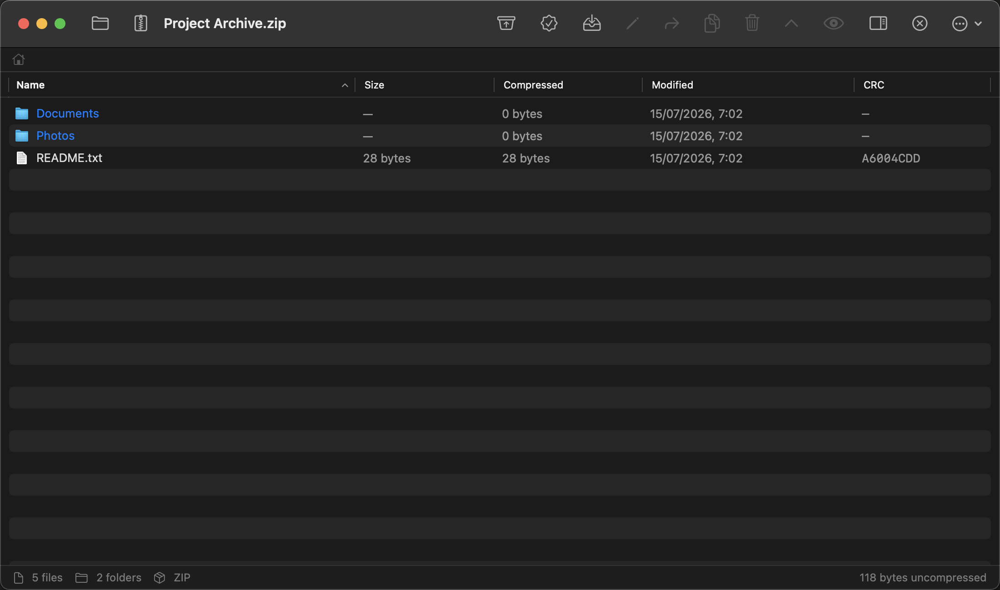

# 7ZIP4MAC-INTEL

A native macOS graphical interface for [7-Zip](https://www.7-zip.org/), built to
feel like a first-party Apple application. 7ZIP4MAC is a frontend only: it drives
the official, unmodified `7zz` engine, which is bundled inside the application.

This repository is the **Intel (x86_64) compatible fork** of
[7ZIP4MAC](https://github.com/jensyleo/7ZIP4MAC), whose `main` branch targets
the latest macOS only. Both projects share the same author and license.

> Built specifically for **Intel-based Macs (x86_64)** — not a universal
> binary; the arm64 slice is intentionally excluded (`ARCHS`/`VALID_ARCHS`
> pinned to `x86_64`). Minimum deployment target: **macOS 13 (Ventura)**,
> chosen so the app keeps running on Intel Macs. Apple Silicon users should
> use [7ZIP4MAC](https://github.com/jensyleo/7ZIP4MAC) instead. (The
> `SevenZipKit` engine package stays broadly portable.)

> Status: **v1.3.1**

## Screenshot



## Features

- **Open and browse** almost anything 7-Zip supports (7z, zip, tar, gz, bz2, xz,
  rar, iso, cab, cpio, arj, lzh, wim, rpm, deb, chm, and more) with hierarchical
  folder navigation, sortable columns, and real per-file-type icons.
- **Extract** the whole archive or a selection, with live progress
  (percent/speed/ETA), cancellation, and a configurable policy for files that
  already exist at the destination (Overwrite / Skip / Rename Extracted File —
  Settings ▸ General).
- **Create archives** (7z / ZIP / TAR) with a chosen compression level, optional
  password + filename encryption, split volumes, and built-in or custom
  compression profiles.
- **Edit archives in place** — Add, Rename, Move, Copy and Delete entries inside
  an already-created archive, without a full re-compress.
- **Password-protected archives**: the password is asked for and kept only in
  memory for that session (never written to disk); the prompt caps out at 3
  attempts before resetting the window.
- **Drag an entry out to Finder** or preview it (or several selected entries,
  with arrow-through navigation) in place with **Quick Look** (Space bar).
- **Test** an archive's integrity, run a **compression benchmark**, and browse
  recently opened archives.
- File-type associations (Settings ▸ File Types) to make 7ZIP4MAC the default
  handler for the formats it supports — including an "Associate Recommended
  Files…" button that does the common ones in one action (after a warning:
  macOS confirms each format individually).
- AppleScript and Shortcuts/Siri automation (both off by default — enable in
  Settings ▸ Automation).

> **Note:** after associating a format (or uninstalling), Finder's icon for
> already-existing files of that type can take a while to refresh — that's
> Finder's own icon cache, not a broken association. Relaunching Finder
> (⌥-right-click its Dock icon ▸ Relaunch, or `killall Finder` in Terminal)
> usually fixes it; if it doesn't, restarting the Mac reliably clears it.
>
> **macOS 13 note:** on this fork's deployment target, associating a format
> alone isn't enough to make Finder's double-click actually open 7ZIP4MAC —
> `NSWorkspace.setDefaultApplication` doesn't propagate to the LaunchServices
> "All" role that a real Finder double-click consults on macOS 13, so this
> fork also calls the lower-level `LSSetDefaultRoleHandlerForContentType`.
> This is a macOS-version behavior gap, not a code difference: the upstream
> Apple Silicon [7ZIP4MAC](https://github.com/jensyleo/7ZIP4MAC) runs the
> identical association code and doesn't need this extra call on its newer
> deployment target.
>
> **Note:** dragging out several selected entries at once delivers all of
> them to Finder as loose files, same as dragging a single one. (Under the
> hood: `SwiftUI.Table` has no built-in way to bundle a multi-selection into
> one drag session the way `List` does, so multi-selection drags are handled
> by a small AppKit layer using `NSFilePromiseProvider` instead of SwiftUI's
> `.onDrag`.) Double-clicking an entry that's already part of a larger
> selection isn't a supported gesture — click it alone first, then
> double-click normally.

## Architecture

Strict MVVM with a clean separation between UI, logic and the engine:

```
SwiftUI Views  →  ArchiveViewModel  →  ArchiveService  →  SevenZipBridge  →  7zz
   (render)          (state)            (logic)          (process bridge)   (engine)
```

- **`SevenZipKit`** — a standalone, fully unit-tested Swift package containing the
  models (`Archive`, `ArchiveEntry`, `ProgressInfo`, `ExtractionRequest`,
  `CompressionRequest`, `ArchiveFormat`), the typed error type (`ArchiveError`),
  the process bridge (`SevenZipRunner`, `SevenZipBridge`), the `-slt` listing
  parser, the live progress parser/tracker, and the services. No UI dependency.
- **`App`** — the SwiftUI application. Views only render state and forward user
  intents; all logic lives in the ViewModel and the services.

The Views never call the engine directly. The engine is spawned in exactly one
place (`SevenZipRunner`), and standard output / standard error are drained
concurrently so a large listing can never deadlock a pipe. Long operations use a
streaming variant that parses the engine's live progress (`ProgressParser`) and
turns it into throughput/ETA (`ProgressTracker`), and can be cancelled — which
terminates the underlying process.

## The 7-Zip engine

The official `7zz` binary (universal, x86_64 + arm64) is bundled verbatim at
`Contents/Resources/Engine/7zz`. It is never modified. Its license is included
alongside it (`App/Resources/Engine/License.txt`). All compression, extraction,
encryption and archive reading is performed by this engine; the application only
provides the interface.

## Building

Requirements: macOS 13+, Xcode 15+, [XcodeGen](https://github.com/yonaskolb/XcodeGen).

```sh
# Run the core package tests
cd SevenZipKit && swift test

# Generate the project, build, sign (ad-hoc) and install the app
Scripts/build.sh
```

The app is installed to `/Applications/7ZIP4MAC.app`.

> Note: on a development machine the app is signed ad-hoc (`-`). A Developer ID
> signature is needed to distribute it without a Gatekeeper prompt on other
> machines.

## Roadmap

Not currently planned, but kept in mind for a future version:

- **Auto-update** via Sparkle (appcast feed, EdDSA-signed updates).
- **Spotlight indexing** of archive contents (a custom `.mdimporter`), so
  Spotlight can find files *inside* an archive, not just the archive itself.
- **Finder Sync extension** ("Compress with 7ZIP4MAC" in the right-click menu)
  — built once, then removed: macOS requires a paid Apple Developer ID
  signature for `pluginkit` to accept a Finder Sync extension at all, which
  an ad-hoc-signed build doesn't have. Revisiting this needs a Developer ID.

## License

Application code: [GNU GPL v3.0](LICENSE) © 2026 Jensy Leonardo Martínez Cruz.
Bundled 7-Zip engine: GNU LGPL (with the unRAR restriction on commercial use of
the unRAR code), by Igor Pavlov — see `App/Resources/Engine/License.txt`.

This program is free software: you can redistribute it and/or modify it under the
terms of the **GNU General Public License, version 3**. It is distributed in the
hope that it will be useful, but **WITHOUT ANY WARRANTY**. See the [LICENSE](LICENSE)
file for the full text.
